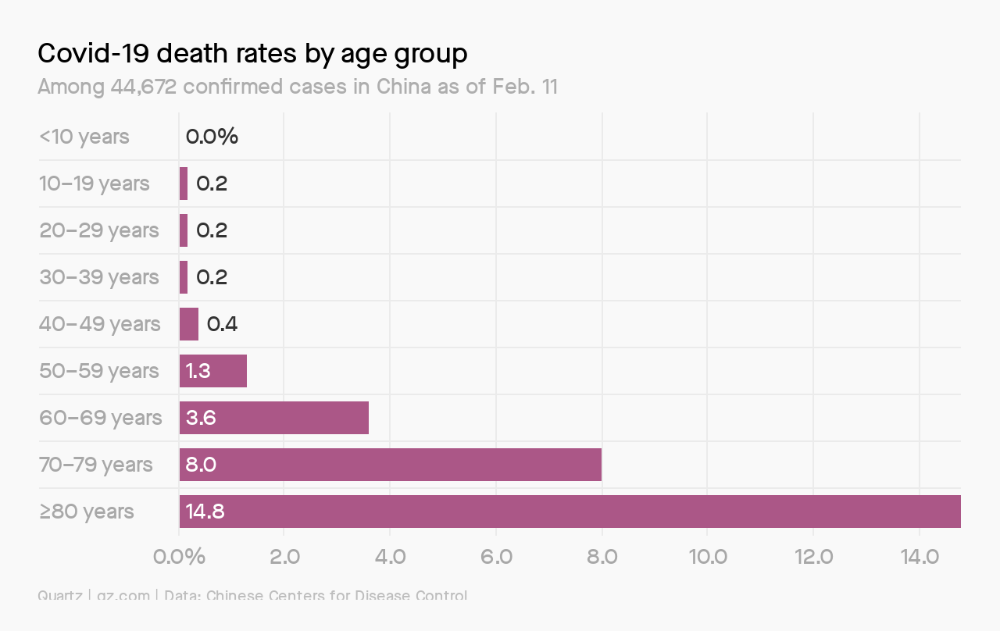

# COVID-19: sense in a time of non-sense

 

As I watch people around me panic, I thought I'd scribble down the words that I have been reciting to my husband three times a day for the last week. He is an emotional person, like many, and has found it hard to keep a focused, rational thinking process about the situation despite his PhD in Systems Biology, 2 Masters and 2 undergrads. If anyone should understand viruses, biology, biochemistry and the spread of disease, it should be my husband yet in times like these, rationality is thrown out the window. So here is my two cents.

I feel people are over-reacting... Yes, the virus has a high transmission rate and has spread across the globe in record time, but for over 80% of cases, the symptoms are mild (fever, tiredness, and dry cough according to the World Health Organization [WHO](https://www.who.int/news-room/q-a-detail/q-a-coronaviruses)) and most make a recovery without any medical intervention. Some patients exhibit aches, pains and nasal congestion. Those who are in danger are generally older people, and people with pre-existing immune or lung issues. Breaking the mortalities by age group, deaths peak after 60 years of age. If you are young and in normal health, your odds of dying from this (~0.2% of cases) are comparable to your chances of [dying in a motor vehicle or by falling](https://www.nsc.org/work-safety/tools-resources/injury-facts/chart). 

 

Source: [Here](https://qz.com/emails/coronavirus/1814038/)

For an interesting analysis of the odds of dying from different causes, check out [this video](https://www.youtube.com/watch?v=_vNYQi6ZXss&feature=emb_logo) from the National Safety Council.

 

### Why is there so much hype??

Last year, a virus that [caused paralysis in kids](https://www.the-scientist.com/news-opinion/more-reports-of-children-being-paralyzed-by-mysterious-disease-64962) and older people was spreading in North America. Did you hear about that one? I was much more worried last year than I am in this hype.

I think 3 main factors made this virus the craze it is today:

1- **High Transmission Rate:**
The fact that the virus has affected most countries and spread like wild fire has scared many people despite the mild symptoms in most cases.

2- **The Media/Social Media propaganda:**
Much of the panic is driven by media outlets looking for 'a story' and false information on social media platforms. 

3- **Wallstreet and the effect on the economy**:
I think the fact that the now labelled pandemic started from Wuhan, an industrial epicenter, has caused the average consumer to pay attention. When companies like Apple and others announced a shortage in supply of products and parts, the average consumer was alerted. The stock market plummeted to unprecedented levels in the last few years which increased the panic and brought more attention to the issue.

 

*So is it all dust?*  **No**. It is a serious issue for older people and people with pre-existing health conditions. **BUT** it certainly doesn't require fighting over toilet paper... I bet all my money that the world is not going to end this month, certainly not because of COVID-19. So if you are a healthy adult, **think** before you panic and **think** before you post on social media. Choose your words wisely, especially if you are in a position of power. Be prepared based on your country's recommendation ([here is Canada's](https://www.canada.ca/en/public-health/services/diseases/2019-novel-coronavirus-infection/being-prepared.html)) and sit tight. Also, remember that even if you are a healthy adult, it is our collective responsibility to take care of our more vulnerable individuals. Be responsible and take precautions to protect others.

 

### FAQs

There are FAQs on practically every resource. If you are worried, read through them. Remember to look at **CREDIBLE** resources and **NOT** social media. I understand that good sources can sometimes be more technical than your friend's ranting post, but probably much more accurate. Here are some FAQs that people around me have asked.

 

> What are some good resources to look at?

  

**COVID-19 Resources** (click here)
  

Again, as mentioned above, accurate sources of information are critical at times like these. Social Media is DEFINITELY not a good source.
I would recommend the [World Health Organization](https://www.who.int/emergencies/diseases/novel-coronavirus-2019) for international data. They have a good [dashboard](https://experience.arcgis.com/experience/685d0ace521648f8a5beeeee1b9125cd) to follow the progress of case numbers and a good [Q&A](https://www.who.int/news-room/q-a-detail/q-a-coronaviruses) section. 
For fellow Canadians, the federal government has set up [a page](https://www.canada.ca/en/public-health/services/diseases/2019-novel-coronavirus-infection.html), as well as most provincial governments. Here's ours in [Quebec](https://www.quebec.ca/en/health/health-issues/a-z/2019-coronavirus/#c46349).

 
 

> If it is really not severe, why are governments taking serious measures?

  

**Why?** (click here)
  

It is the government's job to protect ALL it's people, especially its most vulnerable. Given the higher risk for certain age groups and individuals, it is the government's responsibility to take serious measures to mitigate risk. These measures should reassure you, not scare you. Canada is a developed nation; have trust in the system and in fellow Canadians.

The second reason governments take action is simple politics. Politicians need to be re-elected and to do so, they have to pay attention to people who vote. If a mass panic ensues and governments don't react adequately, despite unnecessary changes at times, governments fall in the next election cycle. 

 
 

> Should we be scared?

  

**Should I panic?** (click here)
  

**NO**. Be prepared. Have the [recommended necessities](https://www.canada.ca/en/public-health/services/diseases/2019-novel-coronavirus-infection/being-prepared.html) and follow [recommended guidelines](https://www.canada.ca/en/public-health/services/diseases/2019-novel-coronavirus-infection/health-professionals/public-health-measures-mitigate-covid-19.html), if not for your own health, then for that of others. 
COVID-19 is serious for some but it is far from the worse thing we've had to face. Again, you have [higher odds of dying from a multitude of other causes](https://www.youtube.com/watch?v=_vNYQi6ZXss&feature=emb_logo).

 
 

> What's with the toilet paper rush?

  

**The sh-t with toilet paper** (click here)
  

There is really no rational reason for the toilet paper craze; none that I can think of anyway. Perhaps it is a leftover thought from previous viruses that caused diarrhea. COVID-19 does not cause diarrhea in most cases. Plus, there are alternatives to using toilet paper, like washing for example. Dry and canned foods with long shelf life seem like a much better investment. 

It is probably human conformity in action. As some irrational people buy excessive toilet paper, others fear of missing out and follow suit, causing a large rush!

Check this [cool experiment on Human Conformity](https://www.youtube.com/watch?v=o8BkzvP19v4&t=1s). That is why logic and critical thinking are important. Don't follow the confused crowd.

 
 

> What should we do now?

  

**Action plan** (click here)

  

Again, Be prepared. Have the [recommended necessities](https://www.canada.ca/en/public-health/services/diseases/2019-novel-coronavirus-infection/being-prepared.html) and follow [recommended guidelines](https://www.canada.ca/en/public-health/services/diseases/2019-novel-coronavirus-infection/health-professionals/public-health-measures-mitigate-covid-19.html), if not for your own health, then for that of others. The 2 week shutdown is supposed to slow the virus propagation to allow medical systems to absorb all critical cases. Avoid unnecessary trips. Read, bake, rest, catch up on your favorite shows and wait it out. **AND BE MINDFUL OF WHAT YOU SHARE ON SOCIAL MEDIA**; don't succumb to panic, don't cause panic.

 
 
